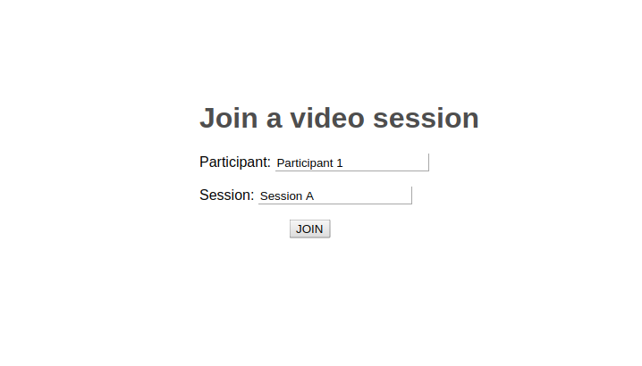

# Openvidu React Demo App

<p align="center">
    
</p>

<p align="center">
    
</p>

## Installation

`git clone https://github.com/srivasd/demo-openvidu-react.git`

`npm install`

`npm start`

## Usage

_openvidu-server_ and _Kurento Media Server_ must be up and running in your development machine. The easiest way is running this Docker container which wraps both of them (you will need [Docker CE](https://store.docker.com/search?type=edition&offering=community)):

```bash
docker run -p 8443:8443 --rm -e KMS_STUN_IP=stun.l.google.com -e KMS_STUN_PORT=19302 -e openvidu.secret=MY_SECRET openvidu/openvidu-server-kms
```
In App.js:
````
import React from 'react';
import OpenviduReact from 'openvidu-insecure-react-library';
import 'openvidu-insecure-react-library/build/css/index.css';

const App = () => (
  <OpenviduReact wsUrl={"localhost"} sessionId={"A"} participantId={1} token={"ljadskblvlifuvbklieu14857362sff45"} distribution={"default"} />
);

export default App;
````